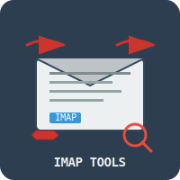

# imaptools

  

Client-side tools for imap

imaptools consists of three programs: imap_search, imap_filter, and
imap_rename. All programs run from your PC against your IMAP server, so
there is no need to install any server side software. imap_filter provides
a way to write easy filter rules.

## License
This software is released into the Public Domain.
